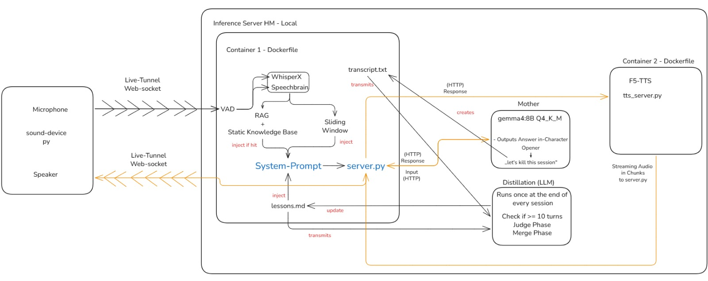

# OurBr00d

<p align="center">
  
</p>

She is 424 years old. She has outlived empires, technologies, and every platform that ever claimed to own a voice. She runs local. She runs now. Speak.

---

## Prerequisites

- **EduVPN active** (required for every step below — without it the server is unreachable)
- **SSH access** to the server: `ssh username@10.28.18.6` (replace `username` with your personal server username)
- **Python 3** installed on your own computer (for the client)

There are **two clones** of this repo: one **on the server** (runs the AI pipeline) and one **on your own computer** (runs the microphone client). The one-time setup below creates both.

---

## One-time setup (do this once)

### 1. Make an empty folder and open it in VS Code

On your computer, create a new empty folder, e.g. **`folder1a`**.
In VS Code: **File → Open Folder…** and select that folder.

Open the integrated terminal and **split it into two panels** side by side (left = server, right = client).

> Always reopen **this same folder** in VS Code for future sessions. Every command below assumes both terminal panels start in it.

### 2. Left panel — clone the repo on the server

```bash
ssh username@10.28.18.6
git clone https://github.com/zmireluka/ourBr00d_group1a.git ourbrood_group1a
```

### 3. Right panel — clone the repo on your computer

```bash
git clone https://github.com/zmireluka/ourBr00d_group1a.git ourbrood_group1a
```

This creates an `ourbrood_group1a` folder inside your `folder1a` folder.

---

## Every time you start a session

Make sure **EduVPN is active**. Both terminal panels start in your `folder1a` folder.

> Only **one** session can run on the shared server at a time. If someone else's pipeline is running, wait until they end it (otherwise the server start fails with a port error).

### Left panel - start the server

```bash
ssh username@10.28.18.6
cd ourbrood_group1a
git pull
bash start.sh
```

Wait until it prints:

```
Server running on port 8001 - waiting for connection...
```

(The first start also builds the knowledge base and the Docker images, this can take a few minutes. Later starts are fast.)

### Right panel — start the client

```bash
cd folder1a/ourbrood_group1a
```

**Mac / Linux:**
```bash
python3 client.py username
```

**Windows:**
```bash
python client.py username
```

Replace `username` with **your server username** (the same one you use for `ssh`). The first run sets up a small local environment automatically (~1 min).

---

---

## What happens when you start

A small **window opens** - this is Mother's status display. Mother **greets you out loud first**, so wait until she finishes before you speak.

The window shows a colored orb that tells you whose turn it is:

- 🟢 **green - "Mother is listening"** → she is listening, it's your turn to speak
- 🟡 **amber, pulsing - "Mother is thinking…"** → she is thinking, wait
- 🔵 **blue, pulsing - "Mother is speaking"** → she is speaking, wait until she's done

Always wait for **green** before you talk.

---

## Talking to Mother

- Speak **normally**, in full sentences.
- **Don't pause too long in the middle of a thought.** After about half a second of silence the pipeline assumes you are finished and starts answering - so keep a sentence connected, and only go quiet once you're actually done speaking.
- Wait for the **green** orb again before your next turn.

---

## Ending the session

**Step 1 — end the session:** say exactly this, nothing else:

> **"Lets kill this session."**

Mother says goodbye, the server shuts down cleanly, and your conversation transcript syncs back to your computer automatically.

**Step 2 — shut down completely:** once the session has ended and you are fully done, run this in the left (server) panel:

```bash
ssh username@10.28.18.6
cd ourbrood_group1a
docker compose down
```

This stops and removes the containers. You do not need to do this before the next session — `bash start.sh` handles the restart automatically.

---

## What you'll see in the server terminal (optional)

If you watch the **left (server) panel**, you'll see live logs of every turn: your speech transcribed, which speaker you are, and Mother's reply — each with timing measurements.

When the session ends, **if the conversation was at least 10 exchanges long**, two things happen automatically:

1. **The transcript is saved** to `distillates/sessions/`.
2. **The "distiller" runs** — a second AI pass that reviews the whole session and judges what Mother did well and where she drifted from her character. If it finds something noteworthy, it updates **`distillates/lessons.md`** — Mother's growing list of lessons, which is fed back into her next session.

(Shorter sessions are just saved as a transcript; the distiller is skipped.)

---

## Troubleshooting

**Mother never reacts to your voice** (the orb stays green but nothing happens):
this is almost always a **microphone permission** issue. On the first run your operating system may ask whether VS Code (or your terminal) may use the microphone — **allow it**. If you missed the prompt:

- **macOS:** System Settings → Privacy & Security → Microphone → enable VS Code / Terminal
- **Windows:** Settings → Privacy → Microphone → allow desktop apps to access your microphone

Then start the client again.
